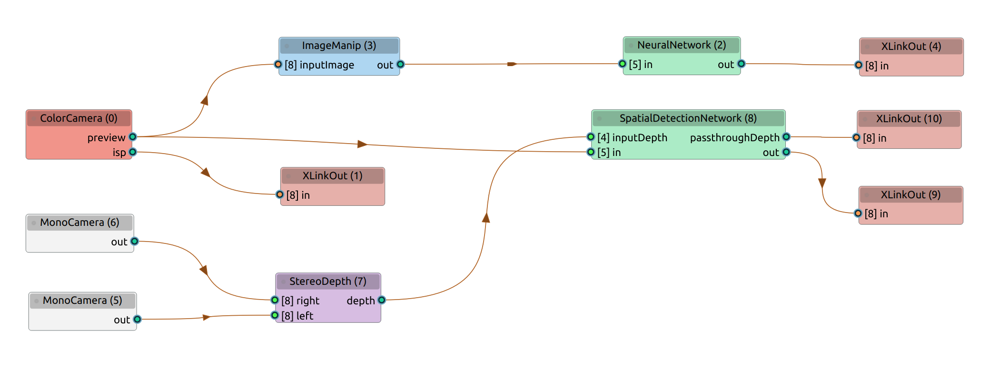
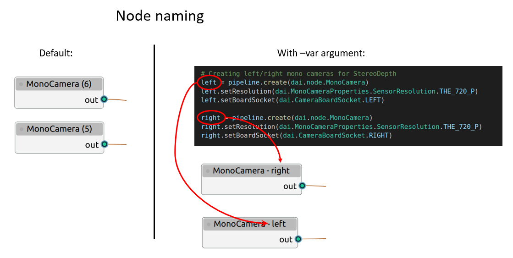
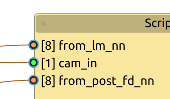

# DepthAI Pipeline Graph [Experimental]

A tool that dynamically creates graphs of [DepthAI pipelines](https://docs.luxonis.com/projects/api/en/latest/components/pipeline/). 
<br>

It is an experimental tool as it relies on the current mode of operation of the DepthAI library, which may change in the future.

## How it works ?
In the DepthAI context, a pipeline is a collection of nodes and links between them. 
In your code, after defining your pipeline, you usually pass your pipeline to the device, with a call similar to:
```
device.startPipeline(pipeline)
```
or
```
with dai.Device(pipeline) as device:
```
What happens then, is that the pipeline configuration gets serialized to JSON and sent to the OAK device. If the environment variable `DEPTHAI_LEVEL` is set to `debug` before running your code, the content of the JSON config is printed to the console like below:
```
[2022-06-01 16:47:33.721] [debug] Schema dump: {"connections":[{"node1Id":8,"node1Output":"passthroughDepth","node1OutputGroup":"","node2Id":10
,"node2Input":"in","node2InputGroup":""},{"node1Id":8,"node1Output":"out","node1OutputGroup":"","node2Id":9,"node2Input":"in","node2InputGroup":""},{"node1Id":7,"node1Output":"depth","node1OutputGroup":"","node2Id":8,"node2Input":"inputDepth","node2InputGroup":""},{"node1Id":0,"node1Output":"preview","node1OutputGroup":"","node2Id":8,"node2Input":"in","node2InputGroup":""},{"node1Id":0,"node1Output":"preview","node1OutputGroup":"","node2Id":3,"node2Input":"inputImage","node2InputGroup":""}, 
...
```
By analyzing the printed schema dump, it is possible to retrieve the nodes of the pipeline and their connections. That's exactly what the tool `pipeline_graph` is doing:
* set  `DEPTHAI_LEVEL` to `debug`,
* run your code,
* catch the schema dump in the ouput stream of the code (by default the process running your code is then terminated),
* parse the schema dump and create the corresponding graph using a modified version of the [NodeGraphQt](https://github.com/jchanvfx/NodeGraphQt) framework.
<br>


<p align="center"> </p>

## Install

```
pip install git+https://github.com/geaxgx/depthai_pipeline_graph.git
```

## Run

Once the installation is done, you have only one command to remember and use: `pipeline_graph`
```
> pipeline_graph -h
usage: pipeline_graph [-h] {run,load} ...

positional arguments:
  {run,load}  Action
    run       Run your depthai program to create the corresponding pipeline
              graph
    load      Load a previously saved pipeline graph

optional arguments:
  -h, --help  show this help message and exit
```

There are 2 actions/modes available: `run` and `load`

### 1) pipeline_graph run


```
> pipeline_graph run -h
usage: pipeline_graph run [-h] [-dnk] [-var] [-p PIPELINE_NAME] [-v] command

positional arguments:
  command               The command with its arguments between ' or " (ex:
                        python script.py -i file)

optional arguments:
  -h, --help            show this help message and exit
  -dnk, --do_not_kill   Kill the command as soon as the schema string has been
                        retrieved
  -var, --use_variable_names
                        Use the variable names from the python code to name
                        the graph nodes
  -p PIPELINE_NAME, --pipeline_name PIPELINE_NAME
                        Name of the pipeline variable in the python code
                        (default=pipeline)
  -v, --verbose         Show on the console the command output

```

As an example, let's say that the usual command to run your program is:
```
python main.py -cam
```
To build the corresponding pipeline graph, you simply use the following command (the quotes are important):
```
pipeline_graph "python main.py -cam"
```
Note that as soon as the `pipeline_graph` program has catched the schema dump, your program is forced to be terminated. It means that your program will possibly not have time to display any windows (if it is something it is normally doing).
If you prefer to let your program do its normal job, use the "-dnk" or "--do_not_kill" argument:
```
pipeline_graph "python main.py -cam" -dnk
```
Note how the `pipeline_graph` own arguments are placed outside the pair of quotes, whereas your program arguments are inside. 
<br>When using the `-dnk` option, the pipeline graph is displayed only after you quit your program.


**Naming of the nodes**

By default, the node name in the grapth is its type (ColorCamera, ImageManip, NeuralNetwork,...) plus a index between parenthesis that corresponds to the order of creation of the node in the pipeline. For example, if the rgb camera is the first node you create, its name will be `"ColorCamera (0)"`.
<br>
When you have a lot of node of the same type, the index is not very helpful to distinguish between nodes. With the `-var` or `--use_variable_names` argument, the index number is replaced by the node variable name used in your code, as explained below:

<p align="center"> </p>

Note that when using this option, `pipeline_graph` will run slower to build the graph (it relies on the python module "trace").

**Ports**

For the input ports, the color represents the blocking state of the port (orange for blocking, green for non-blocking), and the number between [] corresponds to the queue size.

<p align="center"> </p>
<br>
Once the graph is displayed, a few operations are possible.
You can move the nodes and you probably will because there is a big chance that the auto-layout is not the most appropriate layout. You can rename a node by double-clicking its name. If you double-click in a node (apart the name zone), a window opens which let you change the node color and its name.
By right-clicking in the graph, a menu appears: you can save your graph in a json file, load a previously save graph or do a few other self-explanatory operations.<br>
<br>

### 2) pipeline_graph load
Use it to open and edit a previously saved pipeline graph.

```
> pipeline_graph load -h
usage: pipeline_graph load [-h] json_file

positional arguments:
  json_file   Path of the .json file

optional arguments:
  -h, --help  show this help message and exit

```

## Credits
* [NodeGraphQt](https://github.com/jchanvfx/NodeGraphQt) by jchanvfx.
